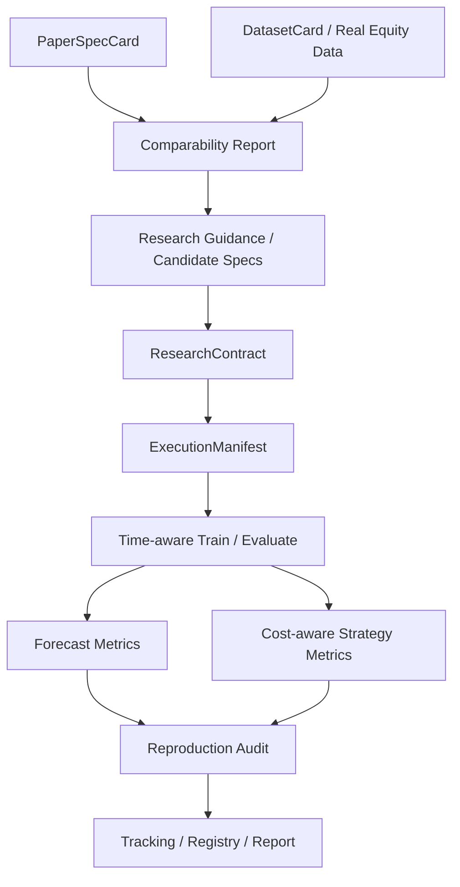

# Finance Forecast Agent - Automated ML Research & Evaluation Harness

A public, runnable portfolio project for **reproducible ML experimentation on financial time-series data**.

The repository demonstrates how to turn paper-inspired research ideas and real market data into **explicit experiment contracts, executable model candidates, time-aware validation, cost-aware evaluation, tracking, and reproducibility audits**.

It is intentionally **not** presented as a trading bot, a profitable strategy, or a strict reproduction of published papers. The current public version uses real U.S. equity data with explicit comparability and evidence gates so exploratory results are not overstated.

## 15-second verification map

| Capability | Public evidence | What it demonstrates |
|---|---|---|
| Research orchestration | [`src/finance_forecast_agent/harness.py`](src/finance_forecast_agent/harness.py) | Candidate selection, contracts, execution manifests, training, evaluation, tracking, and audit flow |
| Model adapters | [`src/finance_forecast_agent/models.py`](src/finance_forecast_agent/models.py) | Ridge, Random Forest, Gradient Boosting, PyTorch LSTM, Transformer, and GA-LSTM candidates |
| Time-series evaluation | [`src/finance_forecast_agent/splitters.py`](src/finance_forecast_agent/splitters.py) | Rolling-origin / purged walk-forward evaluation rather than random train-test splits |
| Cost-aware metrics | [`src/finance_forecast_agent/evaluation.py`](src/finance_forecast_agent/evaluation.py) | Forecast metrics plus turnover, trading-cost scenarios, net return, hit rate, and Sharpe-style diagnostics |
| Reproducibility / audit | [`docs/CURRENT_IMPLEMENTATION.md`](docs/CURRENT_IMPLEMENTATION.md) | Dataset cards, comparability checks, research contracts, manifests, registries, and reproduction boundaries |
| Automated verification | [`tests/`](tests/) | End-to-end harness checks and real PyTorch sequence-model smoke tests |

**Fast snapshot:** Python · PyTorch · scikit-learn · real U.S. equity data · purged walk-forward validation · Ridge / RF / Gradient Boosting / LSTM / Transformer / GA-LSTM · transaction-cost scenarios · MLflow/DVC adapters · experiment manifests · reproducibility audits.

## What this project demonstrates

- Building an **auditable ML research harness**, not just a single forecasting notebook
- Converting research ideas into explicit `CandidateSpec`, `ResearchContract`, and `ExecutionManifest` artifacts
- Comparing classical and deep-learning candidates under one evaluation protocol
- Time-aware validation with **rolling-origin / purged walk-forward** splits
- Financial evaluation that separates raw prediction quality from **cost-aware strategy diagnostics**
- Reproducibility controls for dataset identity, candidate configuration, experiment tracking, and audit state
- Clear distinction between **strict reproduction**, **exploratory real-data reproduction**, and paper-inspired local studies
- Testable separation between research guidance and deterministic ML execution

## Architecture



The key design choice is that **research planning does not directly execute arbitrary model code**. Candidate intent is compiled into explicit contracts and manifests before deterministic training and evaluation run.

## End-to-end workflow

```text
Paper protocol
+ Real local dataset
        |
        v
Comparability check
        |
        v
Candidate specifications
        |
        v
Research contract
        |
        v
Execution manifest
        |
        v
Purged walk-forward / rolling-origin training
        |
        +--> Forecast metrics
        |
        +--> Cost-aware evaluation
        |
        v
Reproduction audit
        |
        v
Registry / tracking / report
```

This structure is intended to make it clear **what was actually run, under which assumptions, and how strongly the result may be interpreted**.

## Current model candidates

| Family | Implementation |
|---|---|
| Ridge regression | scikit-learn pipeline with scaling |
| Random Forest | `RandomForestRegressor` |
| Gradient Boosting | `GradientBoostingRegressor` |
| LSTM | Small real PyTorch sequence regressor |
| Transformer | Small real PyTorch Transformer encoder regressor |
| GA-LSTM | Lightweight genetic search over LSTM hyperparameters |

The sequence models are intentionally compact so the repository stays runnable as a portfolio and testing artifact. This project demonstrates **research-system design and evaluation discipline**, not a claim that these specific small architectures are state-of-the-art forecasters.

## Evaluation design

### Forecast-quality metrics

The harness records standard regression diagnostics including:

- MAE
- RMSE
- R2
- directional accuracy

### Time-series validation

Random shuffling is inappropriate for this use case. The project provides rolling-origin and purged walk-forward style splits so model evaluation respects temporal ordering.

### Cost-aware diagnostics

A sign-based strategy evaluator adds explicit execution assumptions:

- commission
- half-spread
- market impact
- optional latency penalty

The report can compare **zero-cost, base-cost, and stress-cost** scenarios and records metrics such as:

- gross return
- net return
- turnover
- cost paid
- buy-and-hold return
- excess return
- hit rate
- Sharpe-style diagnostic

These values are research diagnostics only. They are not presented as live-trading performance.

## Reproducibility and evidence boundaries

The project intentionally separates "the experiment ran" from "the paper was reproduced".

The current public workflow uses real packaged U.S. equity data, but it does **not** contain the original datasets used by the referenced papers. Therefore the public runs are classified as **exploratory real-data reproduction**, not strict paper reproduction.

The harness records or derives artifacts such as:

- paper specification
- dataset card
- comparability report
- candidate specification
- research contract
- execution manifest
- model/evaluation result
- reproduction audit
- paper/dataset registry state
- tracking metadata

See:

- [Current implementation](docs/CURRENT_IMPLEMENTATION.md)
- [Project roadmap](docs/PROJECT_ROADMAP.md)

## Research-guidance boundary

The current public version uses a deterministic `ReplayLLM` fixture for research advice. This means the ML pipeline can be tested without an API key and without allowing an LLM to silently alter experimental execution.

That boundary is deliberate:

- guidance proposes candidates;
- deterministic code owns data loading, splitting, model execution, metrics, cost assumptions, and audit decisions;
- unsupported claims are blocked by explicit reproduction rules.

A broader private R&D line explores richer agent-driven candidate planning and experiment memory, but this public repository only claims the capabilities implemented and testable here.

## What is implemented today

- Real U.S. equity dataset loading and dataset cards
- Paper protocol cards and paper/dataset comparability checks
- Candidate specifications and explicit experiment contracts
- Rolling-origin / purged walk-forward evaluation
- Classical ML and real PyTorch sequence-model adapters
- Cost-aware evaluation with multiple cost scenarios
- PaperDatasetRegistry
- MLflow and DVC adapters with local fallbacks when optional packages are unavailable
- Reproducibility audits and generated JSON reports
- Streamlit inspection UI
- Automated tests for core models and the end-to-end harness

## What is intentionally not claimed

- No claim of profitable live trading
- No live brokerage execution
- No claim of strict reproduction without original paper datasets
- No claim that a lower forecast error automatically implies a superior tradable strategy
- No claim that the current `ReplayLLM` fixture is a live autonomous research agent
- No claim that the compact portfolio models are production forecasting models

These boundaries are part of the engineering design, not missing marketing language.

## Roadmap

The public roadmap is organized around progressively stronger research automation:

1. **Trusted research core** - contracts, manifests, time-aware validation, cost-aware evaluation, audit gates
2. **Research memory / registry** - richer experiment memory and dataset provenance
3. **Search efficiency** - Hyperband / successive halving / Bayesian optimization and multi-objective candidate selection
4. **Deployment governance** - shadow / paper / live modes, approvals, kill switches, drift monitoring, and model/risk cards

See [PROJECT_ROADMAP.md](docs/PROJECT_ROADMAP.md) for the explicit implementation boundary between current and planned work.

## Quick start

```bash
pip install -e ".[dev]"
PYTHONPATH=src python scripts/run_finance_agent.py
PYTHONPATH=src python -m pytest tests -q
```

Optional UI:

```bash
pip install -e ".[ui]"
PYTHONPATH=src python -m streamlit run apps/streamlit_app.py
```

Optional experiment tracking adapters:

```bash
pip install -e ".[tracking]"
```

## Repository map

```text
apps/
  streamlit_app.py           # inspection UI

docs/
  CURRENT_IMPLEMENTATION.md  # implemented scope and architecture
  PROJECT_ROADMAP.md         # planned research-automation stages

src/finance_forecast_agent/
  comparability.py           # paper vs local-data comparability
  contracts.py               # research contracts / execution manifests
  data.py                    # real-data loading and dataset cards
  evaluation.py              # forecast + cost-aware evaluation
  harness.py                 # end-to-end orchestration
  models.py                  # sklearn + PyTorch model adapters
  papers.py                  # built-in paper protocol specs
  registry.py                # paper/dataset registry
  replay_llm.py              # deterministic research-advice fixture
  schemas.py                 # typed research artifacts
  splitters.py               # time-series split logic
  tracking.py                # MLflow / DVC adapters

tests/
  test_core.py
  test_models_and_harness.py
```

## Why this matters for AI / ML engineering work

The same engineering patterns apply beyond finance:

- evaluating multiple model candidates under one locked protocol
- separating AI-generated suggestions from deterministic execution
- creating reproducible experiment manifests
- preventing data/evaluation leakage
- tracking model and dataset provenance
- distinguishing optimization evidence from real downstream value
- building automated research loops that can later support agents safely

This makes the repository relevant to work involving **ML evaluation, AI training, research agents, automated experimentation, forecasting systems, and model-quality infrastructure**.

## Related public engineering showcases

- [27B LLM Fine-Tuning, Evaluation & vLLM Deployment](https://github.com/summerming1/llm-posttraining-case-study) - post-training, blinded evaluation, RAG-separated evaluation and multi-GPU serving
- [Production RAG Agent](https://github.com/summerming1/production-rag-agent) - hybrid retrieval, RRF, reranking, citations, retrieval metrics and bounded orchestration
- [Industrial CV Production Pipeline](https://github.com/summerming1/industrial-cv-production-pipeline) - segmentation, ROI/spatial logic, temporal event detection and ONNX/TensorRT deployment patterns

## Portfolio interpretation

This repository should be read as evidence of **ML systems engineering, evaluation design, reproducibility, and automated research orchestration**. Numeric outputs from the included datasets are experimental diagnostics, not investment advice or claims of future market performance.
