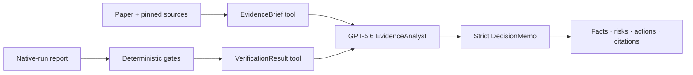

# ForecastProof — Build Week submission brief

> Status: product flow implemented locally. Public demo URL, screenshots, and the final video URL must be added before Devpost submission.

## One-line pitch

ForecastProof turns a forecasting paper claim into an auditable decision: cited evidence, deterministic reproduction gates, and a safe go/no-go memo powered by GPT-5.6.

## What the product does

Research and investment teams regularly inherit impressive forecasting claims but lack a fast way to answer three practical questions:

1. What exactly did the paper claim?
2. Did a local run follow the same evidence, data, and protocol?
3. Is the result strong enough to justify the next research step?

ForecastProof makes that path inspectable. The judge-facing demo uses a strict DLinear claim on the Exchange-Rate benchmark:

- **Analyze:** loads a MethodCard with pinned paper, repository, and dataset evidence.
- **Verify:** replays four deterministic gates against a real native-run report.
- **Decide:** produces a cited memo with verified facts, risks, next actions, and a research-only guardrail.
- **Research lab:** preserves the original seven-stage workbench for advanced users without exposing its complexity in the golden path.

## Why GPT-5.6 is core

The live `EvidenceAnalyst` uses the OpenAI Responses API with GPT-5.6. It must call both read-only tools before it may write a memo:

- `get_evidence_brief`
- `get_verification_result`

The final memo uses a strict JSON Schema. The model synthesizes the decision narrative, while deterministic Python gates remain the authority for evidence, protocol, dataset hash, and metric tolerance. This separates agentic reasoning from governance.



## Verified demo facts

| Check | Result |
|---|---:|
| Evidence audit | 31 spans passed |
| Protocol fidelity | split, scaling, model, optimizer, and seed matched |
| Dataset integrity | SHA-256 matched |
| Paper MSE / local MSE | 0.081 / 0.0810795 |
| Paper MAE / local MAE | 0.203 / 0.2060906 |
| Acceptance tolerance | 0.01 |
| Verdict | reproduced |

The page is explicitly labeled **verified artifact replay**. It reruns deterministic validation against a frozen native training report and does not pretend to retrain during the demo.

## What was built during Build Week

The pre-event baseline is commit `ffa048e` (`2026-07-13 10:42 +08:00`). The official event work is evidenced by the range:

```bash
git log --oneline ffa048e..codex/openai-build-week
git diff --stat ffa048e..codex/openai-build-week
```

The following commits were created after the event opened, even though the dedicated branch pointer was created later:

| Commit | Work |
|---|---|
| `16ab79e` | P1 reproduction and benchmark workflows |
| `814a08e` | live LLM MethodCard normalization |
| `4e388cd` | strict LLM reproduction validation |
| `5681e9b` | multi-paper research generality validation |
| final branch commit | ForecastProof product, GPT-5.6 Responses agent, tests, and submission assets |

Git branches are movable pointers. The branch creation timestamp does not decide whether work is pre- or post-event; commit timestamps, diffs from the documented baseline, and Codex session history provide the evidence.

## Local run and test

```bash
pip install -e ".[dev,ui,pdf]"
python -m streamlit run apps/streamlit_app.py
python -m pytest -q tests/test_forecastproof.py tests/test_streamlit_workbench_app.py
python -m ruff check apps src tests
```

Live mode:

```bash
copy .env.example .env
# Add OPENAI_API_KEY locally. Never commit .env.
python -m streamlit run apps/streamlit_app.py
```

## Three-minute judge path

1. Open **Home** and state the promise: “from paper claim to auditable decision.”
2. Open **Analyze** and expand one paper evidence span and one official-repository span.
3. Open **Verify** and show the four green gates, paper-versus-local chart, and frozen hashes.
4. Open **Decision memo** in verified replay mode, then show live GPT-5.6 and its tool trace if a key is configured.
5. End on the guardrail: reproduced forecasting error is a research milestone, not an investment recommendation.

## Devpost-ready project description

### Inspiration

Forecasting research moves faster than teams can validate it. A strong metric in a paper is often separated from the exact data split, preprocessing, source revision, and assumptions needed to reproduce it. We wanted an agent that helps teams make a better research decision without asking them to trust an uncited summary.

### What it does

ForecastProof converts a forecasting claim into an evidence brief, checks a local reproduction with deterministic gates, and creates a cited decision memo. Its default DLinear sample runs without setup, so every judge can inspect the complete flow. Advanced users can enter the Research lab for the underlying seven-stage workflow.

### How we used GPT-5.6

Our GPT-5.6 EvidenceAnalyst runs on the Responses API. It calls two read-only tools for the evidence brief and verification result, then returns a strict structured memo. GPT-5.6 is responsible for evidence-aware synthesis and decision framing; it cannot override the deterministic gates or turn a forecasting metric into financial advice.

### How we built with Codex

Codex helped audit the existing research harness, isolate the hackathon work in a dedicated local clone, redesign the Streamlit information architecture, implement the Responses tool loop and schema, add tests, and maintain a documented pre-event baseline. The Codex task history and `ffa048e..HEAD` diff are part of the build evidence.

### Challenges

The hardest design choice was separating “the experiment reproduced a paper metric” from “the model is suitable for production.” We solved it by making deterministic comparability gates authoritative and forcing the final memo to show verified facts, unresolved risks, and next actions separately.

### What's next

Next we will add user-supplied paper ingestion, out-of-period finance datasets, team review links, and evals for citation completeness and decision consistency.

## Submission checklist

- [ ] Deploy a public Streamlit URL and test in a clean browser.
- [ ] Record a 2:30–3:00 minute English demo using `BUILD_WEEK_DEMO_SCRIPT.md`.
- [ ] Add three screenshots: Home, four verification gates, Decision memo + agent trace.
- [ ] Add the public repository URL and confirm `codex/openai-build-week` is visible.
- [ ] Add the baseline and during-event commit evidence.
- [ ] Confirm live GPT-5.6 works on the deployed environment.
- [ ] Confirm verified replay works when the key is absent or the API is unavailable.
- [ ] Include the research-only / not-investment-advice guardrail.

## Official references

- [OpenAI Build Week](https://openai.com/zh-Hans-CN/build-week/)
- [Responses API migration guide](https://developers.openai.com/api/docs/guides/migrate-to-responses)
- [Function calling guide](https://developers.openai.com/api/docs/guides/function-calling)
- [Structured Outputs guide](https://developers.openai.com/api/docs/guides/structured-outputs)
- [GPT-5.6 model page](https://developers.openai.com/api/docs/models/gpt-5.6-sol)
