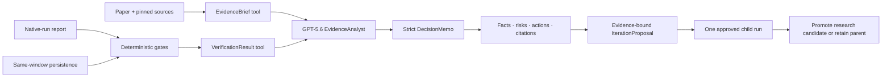

# ForecastProof — Build Week submission brief

> Status: product flow, cost controls, deterministic memo eval, Audit Pack, evidence-guided controlled iteration, and local automated tests are implemented. Public demo URL, screenshots, final video URL, eligibility confirmation, and Devpost fields must still be completed before submission.

The current v0.4 live Luna acceptance run completed the two-tool Responses loop in two API requests and passed the seven-check deterministic memo audit at 100/100 while disclosing the failed persistence value gate. It used 3,615 input and 927 output tokens; the OpenAI list-rate reference is `$0.009177` and may differ from compatible-provider billing.

The current v0.5 adds a zero-API-cost Iteration Lab. It pre-registers 28 earlier development folds for diagnosis and reserves 13 later folds for untouched promotion. The committed SPY-volatility child improved holdout RMSE by 1.18%, but regressed the worst holdout MAE slice by 20.30%, so deterministic gates retained the parent and kept deployment unauthorized.

## One-line pitch

ForecastProof proves whether a forecasting paper reproduced, challenges whether it beat a naive baseline, turns that boundary into an audited GPT-5.6 decision, and runs one evidence-bound next experiment without hiding weak-slice regressions.

## What the product does

Research and investment teams regularly inherit impressive forecasting claims but lack a fast way to answer five practical questions:

1. What exactly did the paper claim?
2. Did a local run follow the same evidence, data, and protocol?
3. Did it add value over a simple same-window baseline?
4. Is the result strong enough to justify the next research step?
5. What bounded experiment should run next, and did it improve safely enough to earn research promotion?

ForecastProof makes that path inspectable. The judge-facing demo uses a strict DLinear claim on the Exchange-Rate benchmark:

- **Analyze:** loads a MethodCard with pinned paper, repository, and dataset evidence.
- **Verify:** replays four deterministic gates against a real native-run report.
- **Challenge:** recomputes last-value persistence over 1,422 identical test windows and exposes the thresholds that flip the decision.
- **Decide:** produces a cited memo with verified facts, risks, next actions, and a research-only guardrail.
- **Iterate:** diagnoses only earlier development folds, binds a proposal to literature and performance evidence, requires human approval, and runs exactly one allow-listed child.
- **Protect the holdout:** later chronological folds remain untouched until the proposal is fixed, avoiding adaptive reuse of the same test evidence.
- **Promote or retain:** checks identical target rows, primary and secondary metrics, runtime, finite values, and worst-slice MAE; even a passing child remains research-only.
- **Audit:** deterministically checks gate authority, tool grounding, citation mappings, evidence coverage, completeness, safety, and naive-challenger honesty; the verified replay scores 100/100.
- **Export:** downloads a complete versioned Audit Pack with evidence, protocol delta, verification, memo, provenance, response ID, and token/cost metadata.
- **Research lab:** preserves the original seven-stage workbench for advanced users without exposing its complexity in the golden path.

## Why GPT-5.6 is core

The live `EvidenceAnalyst` uses the OpenAI Responses API with GPT-5.6. It must call both read-only tools before it may write a memo:

- `get_evidence_brief`
- `get_verification_result`

The final memo uses a strict JSON Schema. The model synthesizes the decision narrative, while deterministic Python gates remain the authority for evidence, protocol, dataset hash, and metric tolerance. This separates agentic reasoning from governance.

The judge-facing live form is cost controlled: the recommended GPT-5.6 Luna profile uses low reasoning, a 1,600-token cap per API response, `store=false`, and one attempt. The UI aggregates token usage across the tool loop and displays a reference cost estimate. Compatible proxies may bill differently from OpenAI's public list rates.



## Verified demo facts

| Check | Result |
|---|---:|
| Evidence audit | 31 spans passed |
| Protocol fidelity | split, scaling, model, optimizer, and seed matched |
| Dataset integrity | SHA-256 matched |
| Paper MSE / local MSE | 0.081 / 0.0810795 |
| Paper MAE / local MAE | 0.203 / 0.2060906 |
| Persistence MSE / MAE | 0.0811257 / 0.1963566 |
| DLinear vs persistence | MSE +0.06% / MAE −4.96% |
| Naive value gate | hold |
| Deployment readiness | hold; out-of-period regime not tested |
| Acceptance tolerance | 0.01 |
| Verdict | reproduced |
| Controlled child untouched-holdout RMSE | +1.18% improvement |
| Controlled child worst MAE slice | 20.30% regression |
| Iteration decision | retain parent; deployment unauthorized |

The page is explicitly labeled **verified artifact replay**. It reruns deterministic validation against a frozen native training report and does not pretend to retrain during the demo.

## What was built during Build Week

The pre-event baseline is commit `ffa048e` (`2026-07-13 10:42 +08:00`). The official event work is evidenced by the range:

```bash
git log --oneline ffa048e..codex/openai-build-week
git diff --stat ffa048e..codex/openai-build-week
```

The following commits were created after the event opened, even though the dedicated branch pointer was created later:

| Commit | Work |
|---|---|
| `16ab79e` | P1 reproduction and benchmark workflows |
| `814a08e` | live LLM MethodCard normalization |
| `4e388cd` | strict LLM reproduction validation |
| `5681e9b` | multi-paper research generality validation |
| final branch commits | ForecastProof product, GPT-5.6 Responses agent, controlled iteration, tests, and submission assets |

Git branches are movable pointers. The branch creation timestamp does not decide whether work is pre- or post-event; commit timestamps, diffs from the documented baseline, and Codex session history provide the evidence.

## Local run and test

```bash
pip install -e ".[dev,ui,pdf]"
python -m streamlit run apps/streamlit_app.py
python -m pytest -q tests/test_forecastproof.py tests/test_iteration_lab.py tests/test_streamlit_workbench_app.py
python -m ruff check apps src tests
```

Live mode:

```bash
copy .env.example .env
# Add OPENAI_API_KEY locally. Never commit .env.
python -m streamlit run apps/streamlit_app.py
```

## Three-minute judge path

1. Open **Home** and state the promise: “from paper claim to auditable decision.”
2. Open **Analyze** and expand one paper evidence span and one official-repository span.
3. Open **Verify** and show the four green reproduction gates, then the persistence challenge and decision stress test.
4. Open **Decision memo** in verified replay mode, then show live GPT-5.6 and its tool trace if a key is configured.
5. Show the deterministic 100/100 decision audit and download the complete Audit Pack.
6. Open **Iteration lab** and show that the saved child improves average RMSE but fails its worst-slice guardrail, so the parent is retained.
7. End on `Deployment: Unauthorized`: reproduced or improved forecasting error is a research milestone, not an investment recommendation.

## Devpost-ready project description

### Inspiration

Forecasting research moves faster than teams can validate it. A strong metric in a paper is often separated from the exact data split, preprocessing, source revision, and assumptions needed to reproduce it. We wanted an agent that helps teams make a better research decision without asking them to trust an uncited summary.

### What it does

ForecastProof converts a forecasting claim into an evidence brief, checks a local reproduction with deterministic gates, challenges it against same-window persistence, and creates a cited decision memo. Its Iteration Lab then diagnoses earlier development folds, locks the evidence-bound proposal, and evaluates one human-approved child only on later untouched folds. A child earns only research-candidate status when every average and slice guardrail passes. Advanced users can enter the Research lab for the underlying seven-stage workflow.

### How we used GPT-5.6

Our GPT-5.6 EvidenceAnalyst runs on the Responses API. It calls two read-only tools for the evidence brief and verification result—including the naive challenger result—then returns a strict structured memo. GPT-5.6 is responsible for evidence-aware synthesis and decision framing; it cannot override the deterministic gates, hide a failed value gate, or turn a forecasting metric into financial advice.

### How we built with Codex

Codex helped audit the existing research harness, isolate the hackathon work in a dedicated local clone, redesign the Streamlit information architecture, implement the Responses tool loop and schema, add tests, and maintain a documented pre-event baseline. The Codex task history and `ffa048e..HEAD` diff are part of the build evidence.

### Challenges

The hardest design choice was separating “the experiment reproduced a paper metric” from “the model adds practical value,” and then separating “average improvement” from “safe research promotion.” We kept both inconvenient results: DLinear barely beats persistence, and the bounded RF child improves average RMSE while worsening its weakest slice. Deterministic gates disclose both failures and retain the safer incumbent.

### What's next

Next we will add paired tests, pre-registered multi-seed evidence, an ex-ante regime classifier, user-supplied paper ingestion, an out-of-period regime that can close the robustness gate, and team review links.

## Submission checklist

- [ ] Deploy a public Streamlit URL and test in a clean browser.
- [ ] Record a 2:30–3:00 minute English demo using `BUILD_WEEK_DEMO_SCRIPT.md`.
- [ ] Add four screenshots: Home result, reproduction + persistence challenge, Decision memo + agent trace, Iteration lab retain-parent decision.
- [ ] Add the public repository URL and confirm `codex/openai-build-week` is visible.
- [ ] Add the baseline and during-event commit evidence.
- [ ] Confirm live GPT-5.6 works on the deployed environment.
- [ ] Confirm verified replay works when the key is absent or the API is unavailable.
- [ ] Include the research-only / not-investment-advice guardrail.

## Official references

- [OpenAI Build Week](https://openai.com/zh-Hans-CN/build-week/)
- [Responses API migration guide](https://developers.openai.com/api/docs/guides/migrate-to-responses)
- [Function calling guide](https://developers.openai.com/api/docs/guides/function-calling)
- [Structured Outputs guide](https://developers.openai.com/api/docs/guides/structured-outputs)
- [GPT-5.6 Luna model page](https://developers.openai.com/api/docs/models/gpt-5.6-luna)
